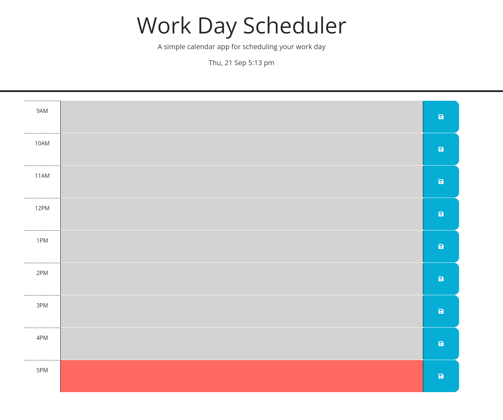

# Daily Planner

A simple and intuitive way to note down the things you need to do each day!

## Description

This project was started with a bit of starter code, most of the Daily planner style and HTML was built out and mainly ready however it was missing JS logic to meet the criteria needed. So, I went in and built out the JS logic for this planner to function properly. I learned quiet a bit while doing so, there were a few challenges that I had not run into prior as this project not only needed JS logic but it needed it all to be within jquery. I had a good idea of what I needed to get built out and got a bit of the code working properly before implimenting jquery. 

This eneded bringing up a very learnable moment for me, as after having built it out in JS alone it still did not work and it took some research to realize that it was because I had pre-built it outside the wrapper and that it needed to be in a jquery wrapper to be loaded after the HTML so that the script could run on the elements proper. I also learned quickly that just moving the plain JS into the Jquery wrapper was not going to be so cut and dry and had to re-work and re-build my logic in jquery over again to make sure everything was working.

I am very glad that the only function I had to re-write like that was the time color changing logic - as the rest was built directly using jquery after that. I also learned a bit about loading structure - all my projects prior did not need to wait to have the JS run until after the elements were loaded like this so honestly I probably wouldn't have known it could be affected like this until running into it organically. 

The project itself is a daily planner, it should display the day, date and time at the top of the page and give an option to add text to any of the time blocks and save any notes you'd like to it. Once saved, you can re-load the page and the notes will still be there. Additionally, based on the current time of day the time blocks will be color coded!

Grey = Times Past
Red = Current Time
Green = Future Times 

## Usage

As mentioned in the description, this project is a daily planner for standard business hours(9am-5pm).
When you access the site here: https://sikoticvinyl.github.io/DailyPlanner/

You should come to a screen that looks like screen shot below. It will have the day of the week followed by the date and current time. Below this you will see a time block for each hour from 9am to 5pm and they should be color coded. In the example below, you can see that all of the blocks are grey except for the 5pm one as it is currently 5:13pm. The time block for 5pm shows as red, and if there were more time blocks beyond 5pm they would be green.

For each block, the colored space is clickable and allows you to type in notes per hour as you would like - just remember to click the blue save button to the right to save your work!
If you save something that you later want to edit or change, you can simply click back into the time block to edit the text, delete text, and save again with or without new content.
If you re-load the page, whatever was saved last should show back up again!

Happy Planning folks!

